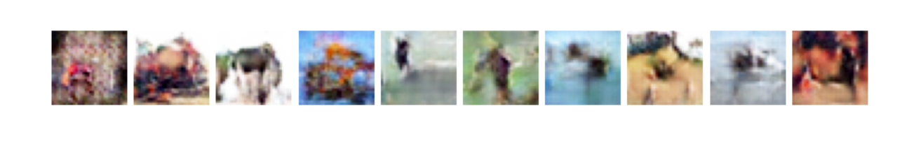

# DCGAN
> Some images generated from the trained Generator (DCGAN):
> 
> 

# LESRCNN
> Some images generated from the trained Generator (LESRCNN):
> 
> 

# DRN

# PAN

# Swin-Transformer

# MAE

# StyleGAN2

